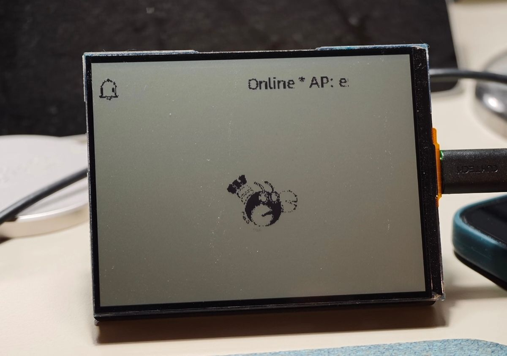

> Note: This is an unofficial board support provided by an user [Karbon Chen](https://github.com/CSY-tvgo), he is not from Espressif or Waveshare. It may have some bugs.  

## TODO
- [ ] The RLCD screen is not colourful, so it's not fully compatible with ESP-Claw's animations. A good solution for converting colourful graphics to black-and-white should be found.  
- [ ] [ST7305 Datasheet](https://www.waveshare.net/w/upload/5/5d/ST_7305_V0_2.pdf) Table 8.2.8 says it supports 4-levels greyscale, but Waveshare's official demo doesn't show this feature. Need to check if the screen support. If so, the display can be better.  

## Related documentation
- [Documentation for ESP32-S3-RLCD-4.2 (English)](https://docs.waveshare.com/ESP32-S3-RLCD-4.2)  
- [Documentation for ESP32-S3-RLCD-4.2 (中文)](https://docs.waveshare.net/ESP32-S3-RLCD-4.2)  
- [ST7305 Datasheet](https://www.waveshare.net/w/upload/5/5d/ST_7305_V0_2.pdf)  
